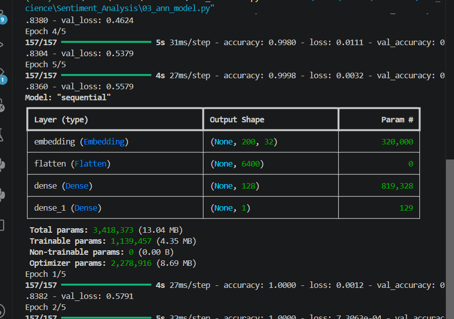
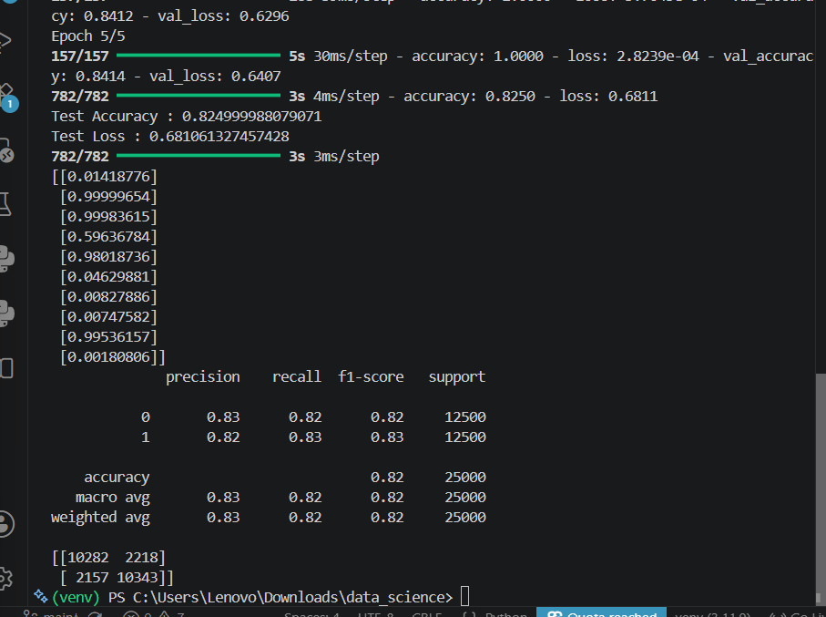
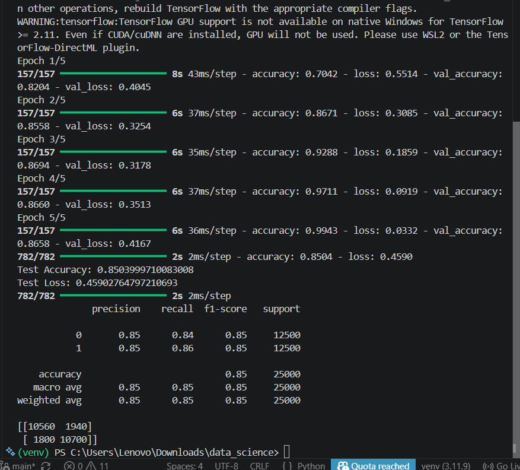
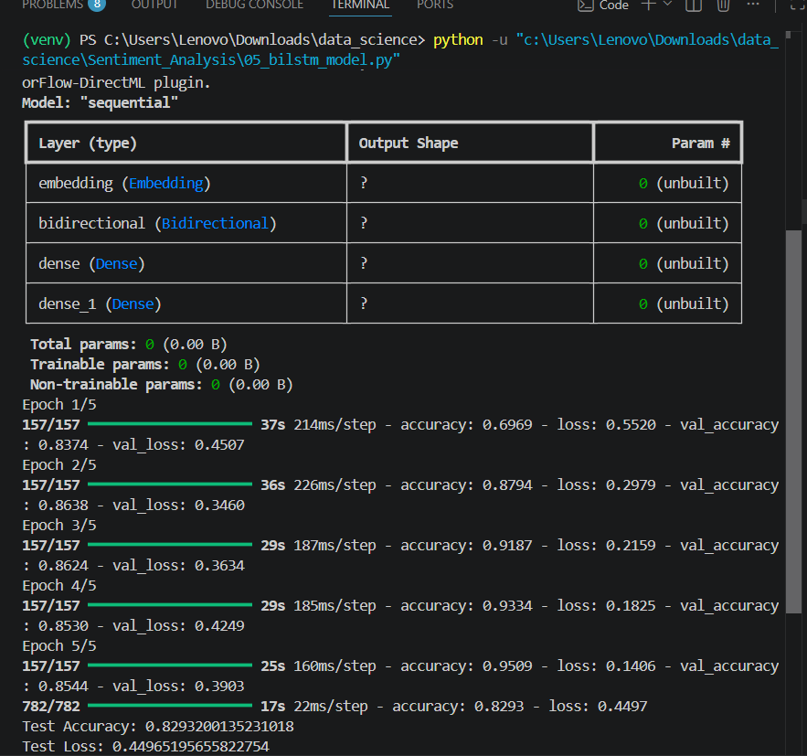
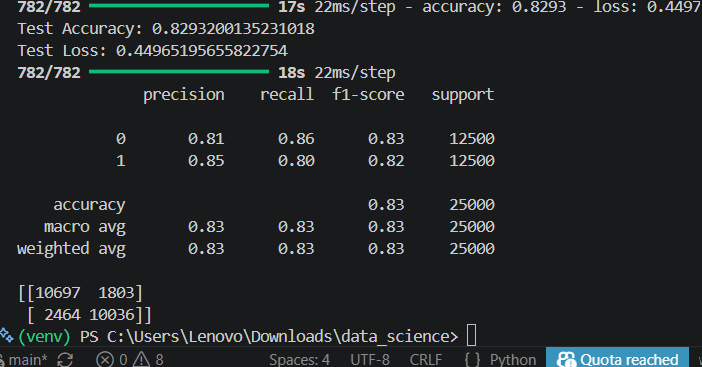

# 🧠 Sentiment Analysis using ANN → CNN → BiLSTM

## 🚀 Project Overview

This project was not about building a single Deep Learning model.

It was about understanding **why Deep Learning architectures evolved over time**.

Instead of directly jumping to LSTM or Transformers, I built three different neural network architectures on the same IMDB Movie Reviews dataset and compared them.

The journey looked like this:

```text
Understand Text Data
        ↓
Preprocessing
        ↓
ANN Baseline
        ↓
Identify ANN Limitations
        ↓
CNN Improvement
        ↓
Identify CNN Limitations
        ↓
BiLSTM Improvement
        ↓
Architecture Comparison
```

The goal was not just achieving higher accuracy.

The goal was understanding **what problem each architecture solves.**

---

# 📌 Dataset

Dataset:

**IMDB Movie Reviews Dataset**

Provided by TensorFlow/Keras.

Total Reviews

- 25,000 Training Reviews
- 25,000 Testing Reviews

Task:

Binary Sentiment Classification

```
Positive Review → 1
Negative Review → 0
```

---

# 🧠 Step 1 : Understanding Text Data

Unlike images,

computers cannot understand English sentences directly.

Example

```
I love this movie.
```

For humans this is meaningful.

For a computer it is just text.

Neural Networks only understand numbers.

Therefore, the first task is converting text into numbers.

---

## What I Learned

Computers work with numbers, not language.

Whenever I see NLP data now, my thinking process becomes:

```
Load Data
      ↓
Understand Text
      ↓
Convert Text into Numbers
      ↓
Prepare Fixed Length Inputs
      ↓
Train Deep Learning Model
```

---

# 🧠 Step 2 : Tokenization

Each review was converted into Token IDs.

Example

```
"I love this movie"

↓

[1, 14, 22, 16]
```

Important Observation

These numbers are **not values**.

They are simply IDs (similar to roll numbers).

The model still does not know the meaning of each word.

---

# 🧠 Step 3 : Padding

Movie reviews have different lengths.

Example

```
Review A → 35 words

Review B → 220 words

Review C → 12 words
```

Neural Networks require equal-sized inputs.

Therefore,

all reviews were padded or truncated to

```
200 words
```

using

```python
pad_sequences()
```

---

## What I Learned

Padding makes every review the same length.

This allows batch training.

---

# 🧠 Step 4 : Word Embedding

Even after tokenization,

words were still represented as IDs.

Example

```
movie → 25

good → 68

excellent → 530
```

These IDs contain no meaning.

Therefore,

an Embedding Layer was introduced.

```
Token ID
      ↓
Dense Vector
```

Each word now receives a learnable vector representation.

Example

```
movie

↓

[0.34, -0.81, 0.57, ...]
```

Now the model can perform mathematical operations.

---

# 🤖 Stage 1 : ANN Baseline

Architecture

```
Input
      ↓
Embedding
      ↓
Flatten
      ↓
Dense (128, ReLU)
      ↓
Dense (1, Sigmoid)
```

---

## Why Flatten?

ANN expects one-dimensional input.

Embedding produces

```
(200,32)
```

Flatten converts it into

```
6400 Features
```

---

## Observation

The ANN successfully learned sentiment classification.

However,

Flatten destroyed the sequence information.

The model treated the review as one long feature vector.

It could not understand nearby words.

Example

```
very good

not very good
```

Both become nearly identical after flattening.

---

## ANN Results

Test Accuracy

```
82.5%

```
<p align="center">

</p>
<p align="center">

</p>

---

# 🧠 Limitation of ANN

ANN cannot understand relationships between neighboring words.

It simply sees thousands of independent features.

This motivated the next architecture.


---

# 🤖 Stage 2 : CNN

Architecture

```
Input
      ↓
Embedding
      ↓
Conv1D
      ↓
GlobalMaxPooling1D
      ↓
Dense
      ↓
Sigmoid
```

---

## Why CNN?

Instead of looking at the entire review,

CNN learns from small groups of nearby words.

Example

```
not good

very bad

must watch
```

These local patterns are called features.

The convolution filters automatically learn them.

---

## What I Learned

CNN understands local context.

Unlike ANN,

it preserves nearby word relationships.

---

## CNN Results

Test Accuracy

```
85.0%
```

CNN outperformed ANN because sentiment is often determined by short phrases rather than isolated words.

<p align="center">

</p>


---

# 🧠 Limitation of CNN

CNN only sees small windows.

Example

```
The movie started slowly...

...

...but the ending was fantastic.
```

CNN struggles to connect information that appears far apart in the sentence.

This motivated the final architecture.

---

# 🤖 Stage 3 : Bidirectional LSTM

Architecture

```
Input
      ↓
Embedding
      ↓
Bidirectional LSTM
      ↓
Dense
      ↓
Sigmoid
```

---

## Why LSTM?

LSTM introduces memory.

Instead of reading small windows,

it reads the sentence one word at a time while remembering important information.

It learns

- what to remember
- what to forget
- what information should influence future predictions

---

## Why Bidirectional?

Humans often understand a sentence only after reading it completely.

Example

```
The movie that everyone praised...

...

...was actually terrible.
```

The last word changes the meaning of the beginning.

Bidirectional LSTM reads

```
Left → Right

AND

Right → Left
```

providing information from both directions.

---

## BiLSTM Results

Test Accuracy

```
82.9%
```

Although BiLSTM is theoretically more powerful,

it did not outperform CNN using the current configuration.

<p align="center">

</p>
<p align="center">

</p>

---

# 🧠 Important Observation

This was one of the biggest learnings from the project.

A more complex architecture does **not** automatically produce better performance.

Performance depends on

- dataset
- hyperparameters
- epochs
- regularization
- optimization

Deep Learning is about experimentation, not assumptions.

---

# 📊 Model Comparison

| Model | Test Accuracy | Observation |
|--------|--------------:|------------|
| ANN | **82.5%** | Good baseline but loses sequence information |
| CNN | **85.0%** | Best performance by capturing local sentiment patterns |
| BiLSTM | **82.9%** | Learns long-term context but required further tuning |

---

# 🧠 Key Learnings

✔ Text must be converted into numbers before training

✔ Token IDs are identifiers, not meaningful values

✔ Embedding learns semantic representations

✔ ANN ignores word order

✔ CNN captures local word relationships

✔ LSTM remembers long-term context

✔ Bidirectional LSTM learns from both past and future context

✔ More complex models are not always better

✔ Model comparison is as important as model building

✔ Deep Learning is an iterative process of experimentation and improvement

---

# 🛠 Technologies Used

- Python
- TensorFlow / Keras
- NumPy
- Scikit-learn
- IMDB Dataset

---

# 🏆 Architecture Comparison

One of the biggest goals of this project was not only to compare the accuracy of different models but also to understand how each neural network architecture processes text differently.

| Feature | ANN | CNN | BiLSTM |
|---------|-----|-----|---------|
| **Input Processing** | Flatten Features | Local Windows | Sequential Words |
| **Memory** | ❌ No | ⚠️ Short Local Context | ✅ Long-Term Memory |
| **Word Order Understanding** | ❌ Lost | ✅ Local Order | ✅ Full Sequence |
| **Reads Both Directions** | ❌ No | ❌ No | ✅ Yes |
| **Training Speed** | ⭐⭐⭐⭐⭐ Fast | ⭐⭐⭐⭐ Fast | ⭐⭐ Slow |
| **Best For** | Simple Baseline | Local Phrase Detection | Long Context Understanding |
| **Test Accuracy** | **82.5%** | **85.0%** | **82.9%** |


# 🎯 Final Conclusion

This project helped me understand the evolution of Deep Learning architectures rather than treating them as independent algorithms.

Instead of asking

> "Which model gives the highest accuracy?"

I learned to ask

> "What limitation does this architecture solve?"

That shift in thinking was the biggest outcome of this project.

Rather than simply building three models, I learned how Deep Learning evolved from ANN to CNN to LSTM by solving the limitations of previous architectures.

This project became a bridge connecting fundamental neural networks with modern NLP architectures such as Transformers.
